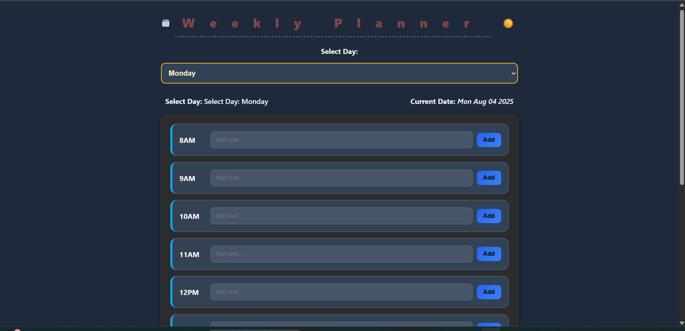
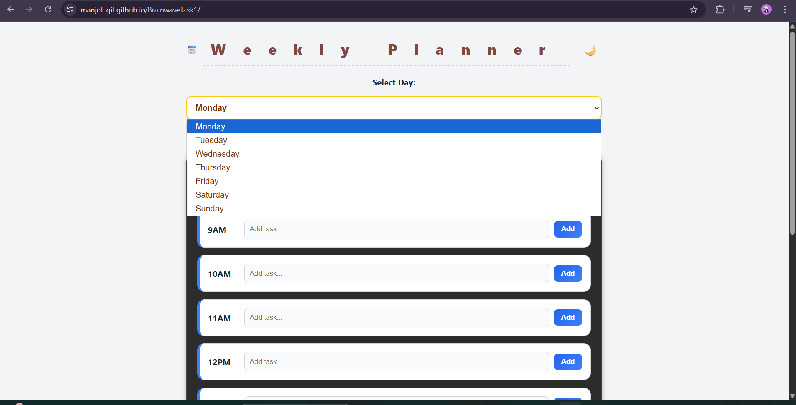

# 🗓️ Weekly Planner 

A simple and intuitive weekly planner built using **HTML**, **CSS**, and **Vanilla JavaScript**. This planner helps users organize their tasks for each day of the week, with hourly blocks and a light/dark mode toggle.

---

## ✨ Features

- ✅ **Add Tasks by Hour**  
  Plan your day from **8AM to 5PM** with editable input blocks.

- 📅 **Select Day Dropdown**  
  Quickly switch between **Monday to Sunday** to plan specific days.

- 💾 **Save Tasks to Local Storage**  
  Automatically saves your input so your plans are **not lost on refresh**.

- 🌙 **Dark/Light Theme Toggle**  
  Toggle between light and dark modes, with preference saved locally.

- 🧹 **Clear This Day**  
  Wipe all tasks for the selected day with a single click.

- 📋 **Weekly Summary Modal**  
  See a summary of all tasks saved throughout the week.

- 🔔 **Toast Notifications**  
  Shows a quick "Task saved!" popup on every save action.

---

## 💻 Technologies Used

- **HTML5**  
- **CSS3**  
- **JavaScript (Vanilla)**  
- **LocalStorage API**

---

## 📸 Screenshots

| Light Mode | Dark Mode |
|------------|-----------|
|  |  |

---

This was for internship Activity.
